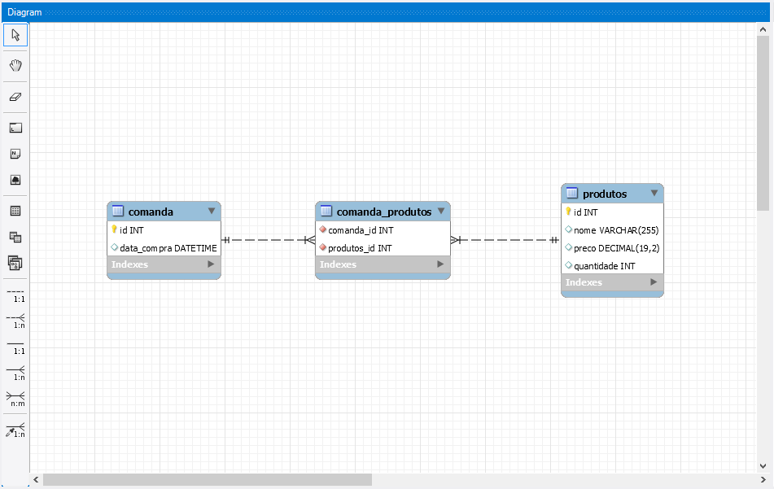
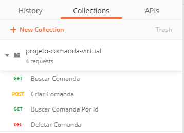
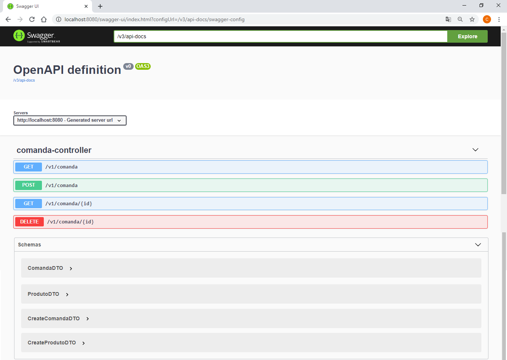
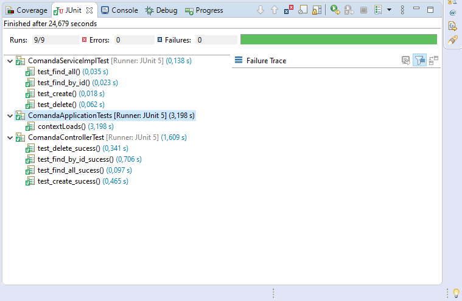

# Projeto Comanda Virtual FIAP - Turma 35SCJ

## Pré-requisitos para execução da aplicação de transação

Tecnologias necessárias:

  1 - Para executar o projeto é necessário ter o JRE 8 ou JDK 8 instalado.
  
  2 - Utilizar uma IDE para execução. (Eclipse é recomendado)
  
  3 - Necessário ter MySQL instalado.
  
---

## Componentes utilizados

  - Spring Web
  - Spring Data JPA
  - MySQL
  - Swagger (Documentação)
  
----

## Instalação e execução do projeto


```sh
$ git clone https://github.com/camisbressan/fiap-microservice-comanda-virtual.git
```


Para iniciar a aplicação, ir no pacote `br.com.fiap.microservice.comanda` existe um arquivo chamado `ComandaApplication.java`. Clique com o botão direito e execute em Run.


----
## Modelo de Dados



----

## Funcionalidades Postman



----

## Documentação Swagger



----

## Testes



----